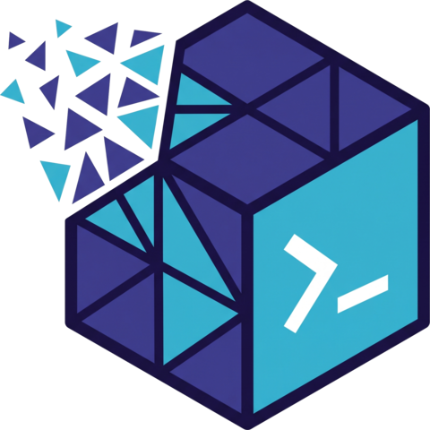

<p align="center">
  
</p>

<h1 align="center">qecs</h1>

<p align="center">
  <a href="https://github.com/araujoviana/qecs/actions/workflows/ci.yml"></a>
  
  
  <a href="LICENSE"></a>
</p>

`qecs` is a Rust CLI that provisions an ephemeral Huawei Cloud (HWC) ECS instance, ships a working directory to it, runs one job, pulls the output back, and destroys the instance. Every VM carries a hard TTL set in its own cloud-init, independent of the client staying connected.

x86_64 Linux only.

## Install

```bash
cargo install --path .
```

Requires Rust edition 2024 (toolchain >= 1.98).

## Configuration

```bash
qecs setup
```

Writes `~/.config/qecs/config.toml` and validates credentials interactively.

Credential resolution (first match wins): `--ak`/`--sk` flags, `QECS_AK`/`QECS_SK`
(`HUAWEICLOUD_SDK_AK`/`SK` and `HWC_AK`/`SK` also accepted, lower precedence), `[credentials]`
in `config.toml`, `.env`/`.env.<profile>` files (`~/.config/qecs/.env`, `./.env`, or paths listed
in `env_files`), then an interactive prompt if the terminal is attached.

| Variable | Description |
|---|---|
| `QECS_AK` / `QECS_SK` | Access / secret key |
| `QECS_SECURITY_TOKEN` | STS token, when using temporary credentials |
| `QECS_REGION` | Region override (e.g. `ap-southeast-3`, `sa-brazil-1`) |
| `QECS_PROFILE` | Selects `.env.<profile>`, same as `--profile` |

## Usage

```bash
qecs run .                                  # auto-detect and run the current directory
qecs run . -e MODEL=llama -- --batch-size 32
qecs run . -c "pytest tests/ -v"
qecs run --preset gpu -a "checkpoints/*.pt" .
```

### Presets

| Preset | Default Flavor | Specs | Storage |
|---|---|---|---|
| `normal` | `s7n.2xlarge.2` | 8 vCPU / 16 GB | 100 GB GPSSD |
| `ram` | `m7.4xlarge.8` | 16 vCPU / 128 GB | 100 GB GPSSD |
| `compute` | `c7.8xlarge.2` | 32 vCPU / 64 GB | 100 GB GPSSD |
| `gpu` | `pi2.4xlarge.4` | 16 vCPU / 64 GB / 2x T4 | 200 GB GPSSD |
| `beefy` | `p2s.8xlarge.8` | 32 vCPU / 256 GB / 4x V100 | 300 GB GPSSD |

Override with `--flavor <FLAVOR_ID>`, or set defaults per preset in `config.toml`.

### Commands

- `qecs run [PATH]`: sync directory, provision VM, execute, retrieve artifacts, destroy.
  - `-p, --preset <NAME>`: `normal`, `ram`, `compute`, `gpu`, `beefy`.
  - `-c, --command <CMD>`: override the detector ladder with a custom command.
  - `-e, --env <KEY=VAL>`: pass an environment variable to the remote process.
  - `--env-file <PATH>`: load variables from a file.
  - `-a, --artifacts <GLOBS>`: comma-separated output patterns to download locally.
  - `-d, --detach`: start the job in the background and exit immediately.
  - `-k, --keep`: do not terminate the VM after the run finishes.
  - `--keep-on-failure`: keep the VM only if the job exits non-zero. On a non-zero exit,
    `qecs` also checks the OOM killer, exit code, and missing shared libraries before
    printing a diagnosis.
  - `-- <ARGS>`: trailing arguments passed to the job.
  - Local ports the job opens (`7860` Gradio, `8501` Streamlit, `8888` Jupyter, `8000`
    FastAPI, `6006` TensorBoard) are tunneled back over the same SSH connection.
- `qecs attach [TARGET]`: reattach to a running job's tmux session (`Ctrl+B d` to detach
  without killing it). Survives a dropped connection or a sleeping laptop.
- `qecs up [--preset NAME] [--ttl DURATION]`: boot a VM with a hard TTL and idle-timeout
  shutdown, no job attached.
- `qecs shell [VM_ID]`: interactive SSH session on a VM, falls back to a one-time VNC
  console URL if SSH is unreachable.
- `qecs ls [--local] [-j]`: list tracked VMs, public IPs, remaining TTL.
- `qecs info <VM_ID>`: full detail on one VM.
- `qecs logs [VM_ID] [-f] [--cloud-init]`: tail job output or cloud-init boot logs.
- `qecs wait <VM_ID>`: block until a detached job finishes.
- `qecs kill [VM_ID] [-a]` (alias `qecs down`): destroy a VM and release its public IP.
- `qecs gc [-f]`: reconcile local state against the cloud, remove orphaned VMs and EIPs.
- `qecs cache ls|clean|destroy`: manage the regional OBS bucket used to cache
  pip/uv/cargo dependencies between runs. `--no-cache` on `run` skips it.
- `qecs image ls|build|delete`: manage pre-baked private images for faster cold starts.
- `qecs mcp serve`: run as a stdio MCP server, exposing `qecs_run`, `qecs_up`, `qecs_ls`,
  `qecs_info`, `qecs_logs`, `qecs_kill` as tools. Add to `claude_desktop_config.json` or
  `.cursor/mcp.json`:

    ```json
    {
      "mcpServers": {
        "qecs": { "command": "qecs", "args": ["mcp", "serve"] }
      }
    }
    ```

## Development

```bash
cargo test --all                         # full test suite
cargo clippy --all-targets -- -D warnings # strict linter check
cargo fmt --check                        # style check
```

Commits use Conventional Commits (`feat:`, `fix:`, `docs:`); a git hook bumps
`Cargo.toml`'s version on each commit based on the type.

## License

[MIT](LICENSE)
